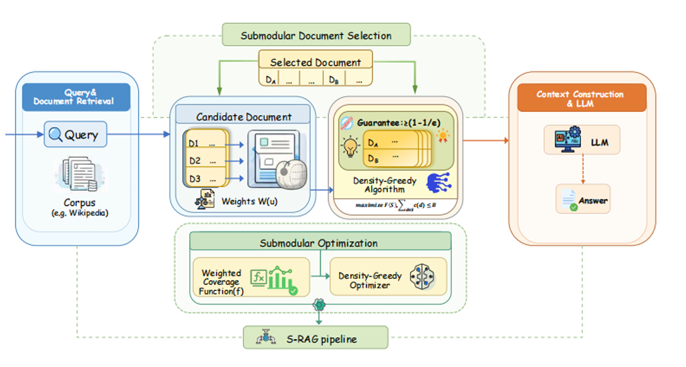

# S-RAG: Optimal Document Selection in RAG via Combinatorial Optimization — A Reproduction Study



## Abstract
We study the problem of document selection in Retrieval-Augmented Generation (RAG): given a pool of retrieved passages and a fixed token budget, how should we choose the subset to include in an LLM's context? This report reproduces and extends Submodular-RAG (S-RAG), a framework that casts the problem as monotone submodular maximization under a knapsack (token-budget) constraint, achieving a (1 − 1/e) approximation guarantee on a weighted concept-coverage surrogate objective [Anonymous, 2025]. We faithfully reproduced S-RAG using NLTK-based concept extraction, a density-greedy selector, and the BGE-large-en-v1.5 dense retriever over the Wikipedia DPR corpus, then evaluate on Natural Questions (NQ), HotpotQA, and ELI5. Our reproduction, run with Qwen2.5-7B-Instruct as the generator, confirms the paper's central finding: S-RAG dominates MMR and Greedy (Rel/Cost) on factoid and multi-hop QA. Top-k turns out to be a surprisingly strong baseline in our setup due to the generator swap.

### Installation of Dependencies

```bash
conda create -n cs240 python=3.11
conda activate cs240
pip install -r requirements.txt
```

### Usage
```bash
CUDA_VISIBLE_DEVICES=0 python generate.py --dataset nq --dataset_path data/NQ-open.dev.jsonl --model_name ./Qwen2.5-1.5B-Instruct --tokenizer_name ./Qwen2.5-1.5B-Instruct --method srag
```

